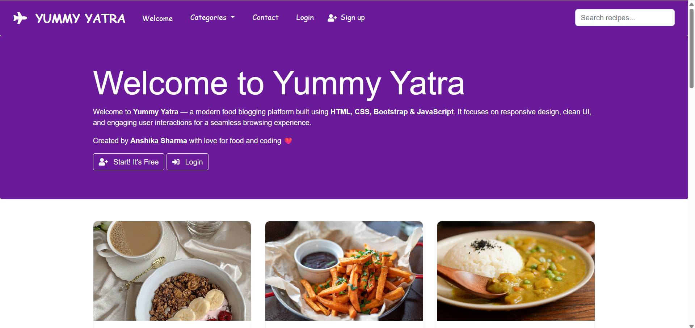
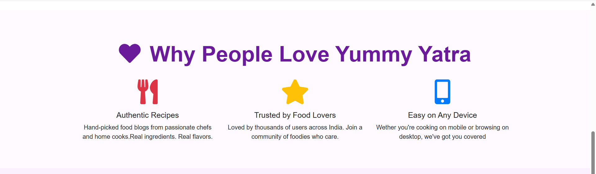
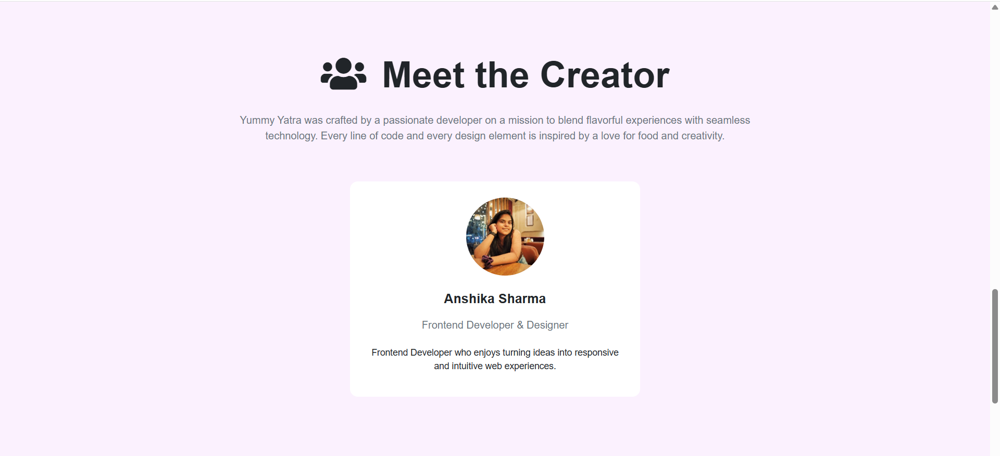
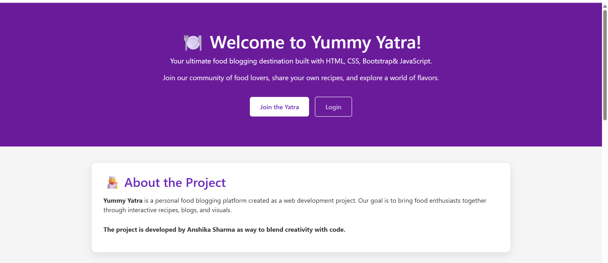
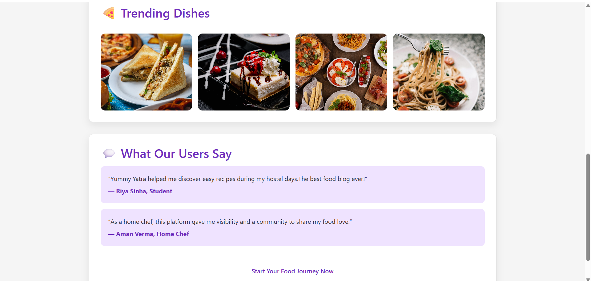
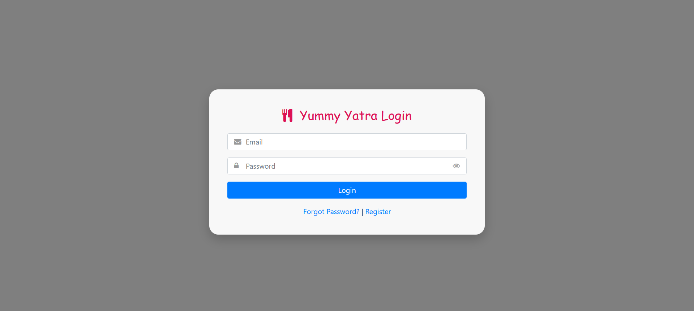
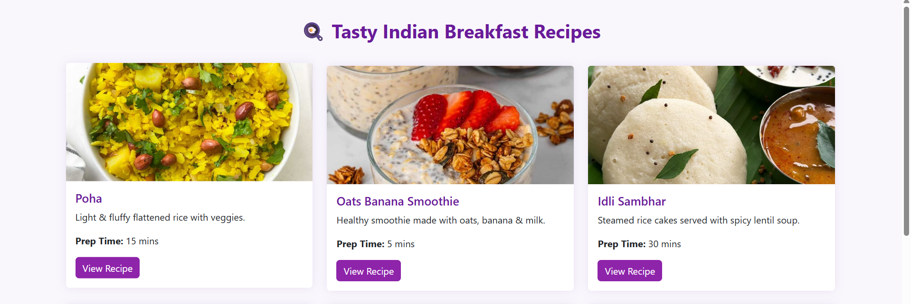
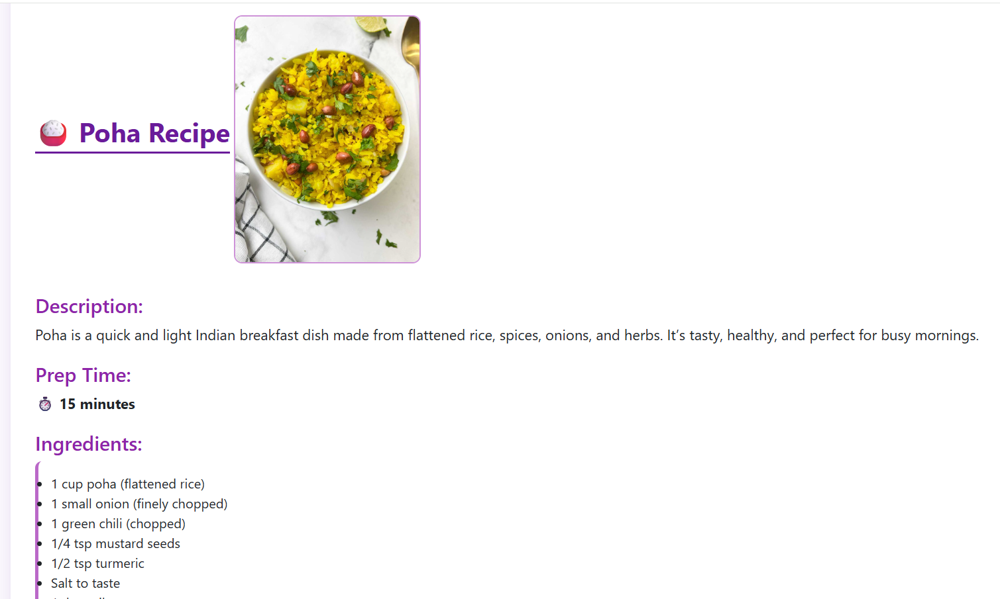
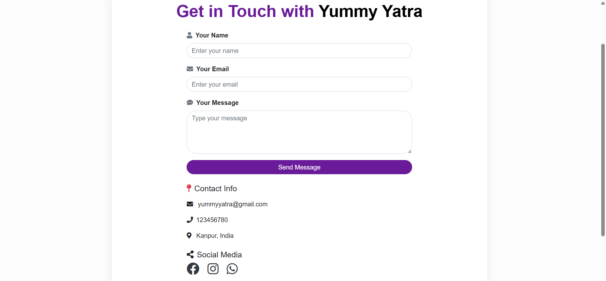

# 🍽️ Yummy Yatra

**Yummy Yatra** is a responsive and visually engaging **food & recipe website** built using **HTML, CSS, and JavaScript**.  
The project focuses on clean UI design, smooth navigation, and an enjoyable user experience for exploring recipes.

---

## 🌟 Project Overview

Yummy Yatra allows users to:
- Explore food categories
- Browse recipes in a structured layout
- Read full recipe details on a dedicated page
- Experience a responsive design across devices

This project is designed as a **frontend real-world website**.

---

## 🚀 Features

- 🏠 Modern Home Page UI  
- 📋 Recipe Listing Section  
- 📖 Dedicated **Read Recipe** Page  
- 📱 Fully Responsive (Mobile, Tablet, Desktop)  
- 🎨 Clean & User-Friendly Interface  
- ⚡ Fast loading static website  

---

## 🛠️ Technologies Used

- **HTML5** – Page structure  
- **CSS3** – Styling & layout  
- **JavaScript (ES6)** – Interactivity  
- **Bootstrap** – Responsive design  
- **Font Awesome / Google Fonts** – Icons & typography  

---

## 📸 Project Screenshots

### 1️⃣ Home Page

### 2️⃣ Home Page2

### 3️⃣ Meet the creator

### 4️⃣ Newsletter

### 5️⃣ Welcome Page

### 6️⃣ Welcome Page 2

### 7️⃣ Login Page

### 8️⃣ Registeration

### 9️⃣ Cards

### 🔟 Food Recipe

###  Contact

------

## 📂 Project Structure

