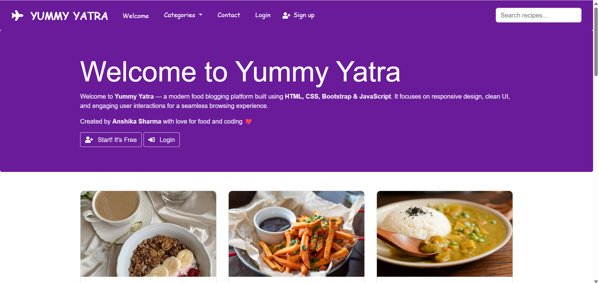
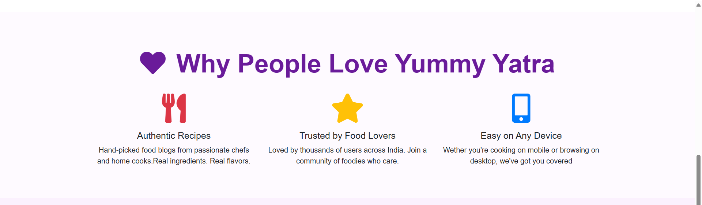
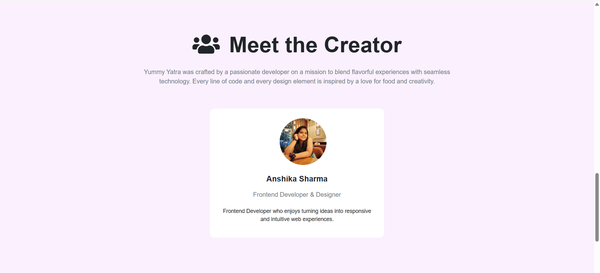
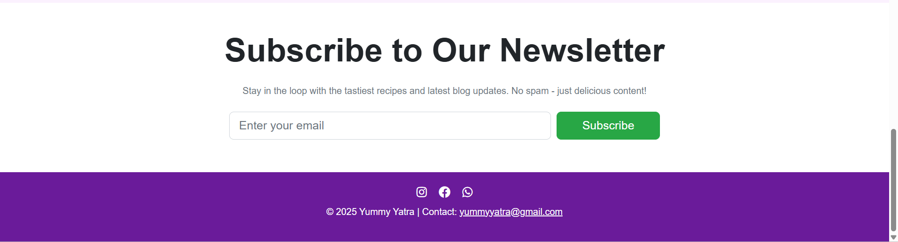
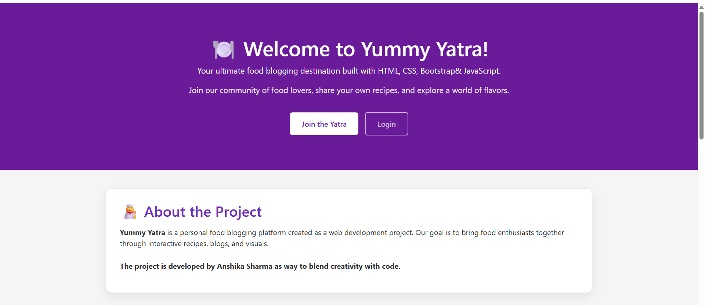
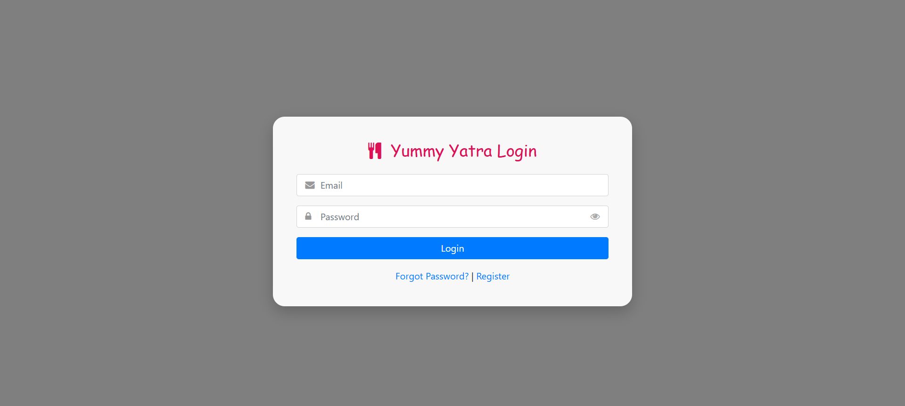
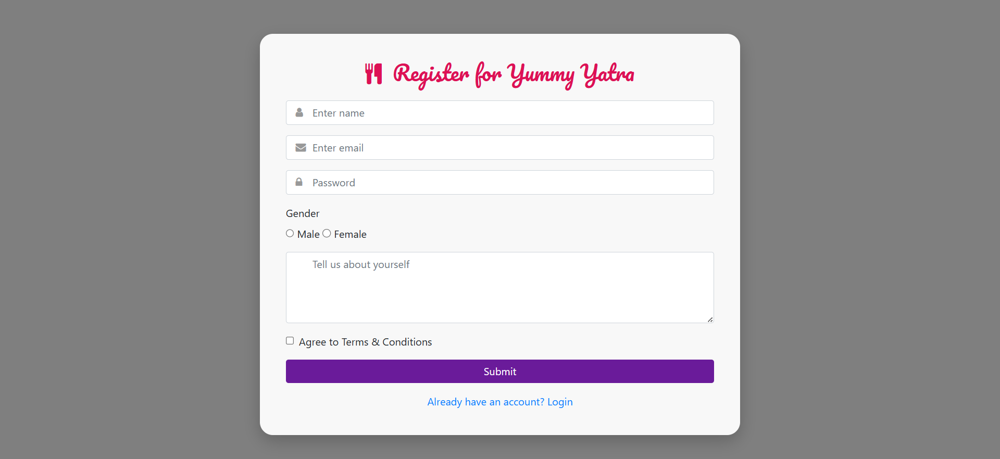
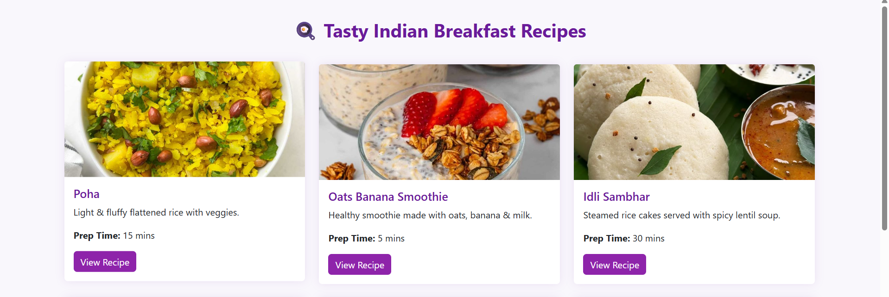
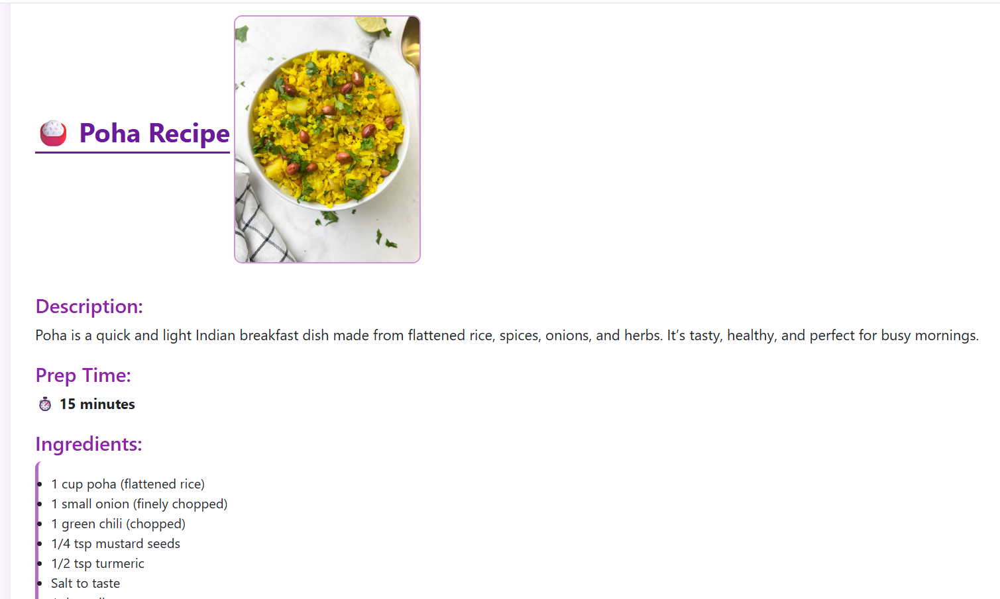
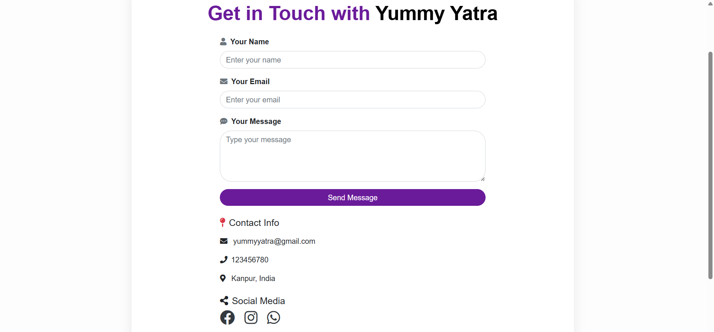

# 🍽️ Yummy Yatra

**Yummy Yatra** is a responsive and visually engaging **Food & Recipe Website** built using **HTML, CSS, Bootstrap, and JavaScript**.

The project focuses on clean UI design, structured layout, and client-side interactivity. It also includes a simulated authentication system using JavaScript and localStorage.

---

## 🌟 Project Overview

Yummy Yatra allows users to:

- 🏠 Explore beautifully designed homepage sections
- 📋 Browse categorized recipes
- 📖 Read full recipe details on a dedicated page
- 🔐 Register and Login (Client-side authentication)
- 👋 Access a protected Welcome page after login
- 📱 Experience a responsive design across devices

This project was created as a **frontend practice project** to demonstrate UI/UX skills and JavaScript functionality.

---

## 🚀 Features

- 🎨 Modern & Clean UI
- 📱 Fully Responsive (Mobile / Tablet / Desktop)
- 🔐 Client-side Authentication using localStorage
- 👤 Dynamic Welcome Message after Login
- 🚪 Logout functionality
- 🔎 Interactive UI elements
- ⚡ Fast static website performance

---

## 🔐 Authentication Logic (Frontend-Based)

Since this is a frontend-only project:

- User data is stored in **localStorage**
- Login credentials are validated using JavaScript
- Protected route logic prevents access to the Welcome page without login
- Logout clears login session state

> Note: This authentication is for demonstration purposes only and not secure for production use.

---

## 🛠️ Technologies Used

- **HTML5** – Structure
- **CSS3** – Styling
- **JavaScript (ES6)** – Interactivity & Authentication Logic
- **Bootstrap 4** – Responsive Layout
- **Font Awesome** – Icons
- **Google Fonts** – Typography

---

## 📸 Project Screenshots

### 1️⃣ Home Page 

### 2️⃣ Home Page2 

### 3️⃣ Meet the creator 

### 4️⃣ Newsletter 

### 5️⃣ Welcome Page 

### 7️⃣ Login Page 

### 8️⃣ Registeration 

### 9️⃣ Cards 

### 🔟 Food Recipe 

### Contact 

## 📂 Project Structure

## 🌐 Live Demo

🔗 https://shiny-froyo-233cd3.netlify.app

## 👩‍💻 Developed By

Anshika Sharma
Frontend Developer (Aspiring Full Stack Developer)
